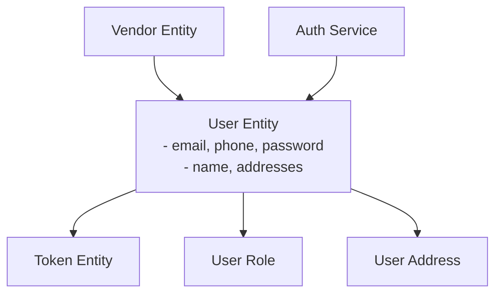
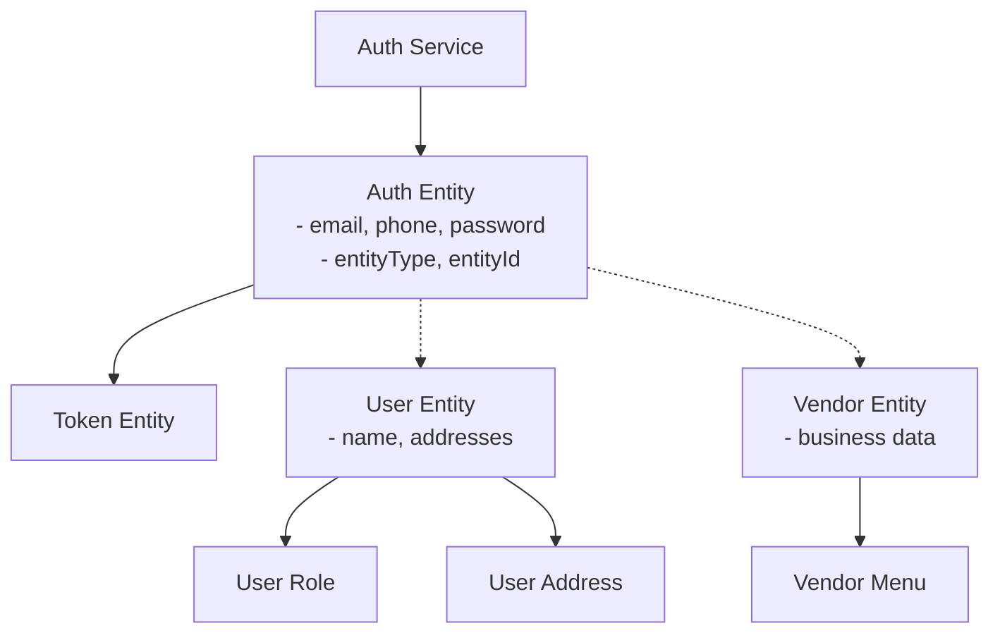

# Auth Entity Architecture Specification

## Executive Summary

This document outlines the redesign of the authentication architecture in the NestJS application, separating authentication credentials from user profile data through a dedicated `Auth` entity. The new design follows clean architecture principles, supports multiple entity types, and provides a scalable foundation for future authentication methods.

## Current Architecture Analysis

### Pain Points Identified

1. **Mixed Concerns**: [`User`](src/users/entities/user.entity.ts:14) entity contains both authentication (`email`, `phone`, `password`) and profile data (`name`, `addresses`)
2. **Tight Coupling**: [`AuthService`](src/auth/auth.service.ts:17) directly depends on [`User`](src/users/entities/user.entity.ts:14) entity
3. **Complex Vendor Authentication**: Vendors authenticate through [`User`](src/users/entities/user.entity.ts:14) with additional role checks in [`VendorsService`](src/vendors/vendors.service.ts:86-101)
4. **Limited Token Management**: [`Token`](src/auth/entities/token.entity.ts:5) directly references [`User`](src/users/entities/user.entity.ts:14), preventing multi-entity authentication
5. **Scalability Limitations**: Difficult to add new authentication methods or entity types

### Current Entity Relationships



## Proposed New Architecture

### Core Design Principles

1. **Separation of Concerns**: Authentication credentials separate from profile data
2. **Polymorphic Relationships**: Support multiple entity types through single Auth entity
3. **Future Extensibility**: Easy addition of new authentication methods
4. **Data Integrity**: Maintain referential integrity during migration
5. **API Compatibility**: Minimal changes to existing endpoints

### New Auth Entity Structure

```typescript
// src/auth/entities/auth.entity.ts
import {
  Entity,
  Column,
  PrimaryGeneratedColumn,
  CreateDateColumn,
  UpdateDateColumn,
  OneToMany,
  Index,
} from 'typeorm';
import { Token } from './token.entity';

export enum AuthEntityType {
  USER = 'user',
  VENDOR = 'vendor',
  ADMIN = 'admin',
}

@Entity('auth')
@Index(['entityType', 'entityId'], { unique: true })
export class Auth {
  @PrimaryGeneratedColumn('uuid')
  id: string;

  @Column({ unique: true })
  email: string;

  @Column({ unique: true })
  phone: string;

  @Column()
  password: string;

  @Column({
    type: 'enum',
    enum: AuthEntityType,
  })
  entityType: AuthEntityType;

  @Column('uuid')
  entityId: string;

  @Column({ default: true })
  isActive: boolean;

  @Column({ nullable: true })
  lastLoginAt: Date;

  @Column({ default: 0 })
  failedLoginAttempts: number;

  @Column({ nullable: true })
  lockedUntil: Date;

  @OneToMany(() => Token, (token) => token.auth)
  tokens: Token[];

  @CreateDateColumn()
  createdAt: Date;

  @UpdateDateColumn()
  updatedAt: Date;

  // Virtual getters for entity relationships
  get user() {
    return this.entityType === AuthEntityType.USER ? { id: this.entityId } : null;
  }

  get vendor() {
    return this.entityType === AuthEntityType.VENDOR ? { id: this.entityId } : null;
  }
}
```

### Updated Entity Relationships



### Updated User Entity

```typescript
// src/users/entities/user.entity.ts
import {
  Entity,
  Column,
  PrimaryGeneratedColumn,
  CreateDateColumn,
  UpdateDateColumn,
  OneToMany,
  OneToOne,
} from 'typeorm';
import { UserRole } from 'src/roles/entities/user-role.entity';
import { UserAddress } from './user-address.entity';
import { Auth } from 'src/auth/entities/auth.entity';

@Entity()
export class User {
  @PrimaryGeneratedColumn('uuid')
  id: string;

  @Column()
  name: string;

  // Remove email, phone, password fields - now in Auth entity

  @OneToOne(() => Auth, (auth) => auth.user)
  auth: Auth;

  @OneToMany(() => UserRole, (userRole) => userRole.user)
  userRoles: UserRole[];

  @OneToMany(() => UserAddress, (address) => address.user)
  addresses: UserAddress[];

  @CreateDateColumn()
  createdAt: Date;

  @UpdateDateColumn()
  updatedAt: Date;

  // Virtual getters for backward compatibility
  get email() {
    return this.auth?.email;
  }

  get phone() {
    return this.auth?.phone;
  }
}
```

### Updated Token Entity

```typescript
// src/auth/entities/token.entity.ts
import { Entity, Column, PrimaryGeneratedColumn, ManyToOne } from 'typeorm';
import { Auth } from './auth.entity';

@Entity()
export class Token {
  @PrimaryGeneratedColumn()
  id: number;

  @Column()
  token: string;

  @Column()
  expiresAt: Date;

  @ManyToOne(() => Auth, { onDelete: 'CASCADE' })
  auth: Auth;
}
```

## Database Migration Strategy

### Phase 1: Schema Changes

1. **Create Auth Entity Table**:
```sql
CREATE TABLE auth (
  id UUID PRIMARY KEY DEFAULT gen_random_uuid(),
  email VARCHAR UNIQUE NOT NULL,
  phone VARCHAR UNIQUE NOT NULL,
  password VARCHAR NOT NULL,
  entity_type VARCHAR NOT NULL CHECK (entity_type IN ('user', 'vendor', 'admin')),
  entity_id UUID NOT NULL,
  is_active BOOLEAN DEFAULT true,
  last_login_at TIMESTAMP,
  failed_login_attempts INTEGER DEFAULT 0,
  locked_until TIMESTAMP,
  created_at TIMESTAMP DEFAULT NOW(),
  updated_at TIMESTAMP DEFAULT NOW()
);

CREATE UNIQUE INDEX idx_auth_entity ON auth(entity_type, entity_id);
```

2. **Update Token Table**:
```sql
-- Add new auth_id column
ALTER TABLE token ADD COLUMN auth_id UUID;

-- Create foreign key relationship
ALTER TABLE token ADD CONSTRAINT fk_token_auth 
  FOREIGN KEY (auth_id) REFERENCES auth(id) ON DELETE CASCADE;
```

### Phase 2: Data Migration

```typescript
// Migration: 1735123456789-SeparateAuthEntity.ts
import { MigrationInterface, QueryRunner } from 'typeorm';

export class SeparateAuthEntity1735123456789 implements MigrationInterface {
  public async up(queryRunner: QueryRunner): Promise<void> {
    // 1. Create Auth table
    await queryRunner.query(`
      CREATE TABLE auth (
        id UUID PRIMARY KEY DEFAULT gen_random_uuid(),
        email VARCHAR UNIQUE NOT NULL,
        phone VARCHAR UNIQUE NOT NULL,
        password VARCHAR NOT NULL,
        entity_type VARCHAR NOT NULL CHECK (entity_type IN ('user', 'vendor', 'admin')),
        entity_id UUID NOT NULL,
        is_active BOOLEAN DEFAULT true,
        last_login_at TIMESTAMP,
        failed_login_attempts INTEGER DEFAULT 0,
        locked_until TIMESTAMP,
        created_at TIMESTAMP DEFAULT NOW(),
        updated_at TIMESTAMP DEFAULT NOW()
      )
    `);

    // 2. Create unique index
    await queryRunner.query(`
      CREATE UNIQUE INDEX idx_auth_entity ON auth(entity_type, entity_id)
    `);

    // 3. Migrate User data to Auth
    await queryRunner.query(`
      INSERT INTO auth (email, phone, password, entity_type, entity_id, created_at, updated_at)
      SELECT 
        email, 
        phone, 
        password, 
        'user' as entity_type, 
        id as entity_id,
        created_at,
        updated_at
      FROM "user"
      WHERE email IS NOT NULL AND phone IS NOT NULL AND password IS NOT NULL
    `);

    // 4. Migrate Vendor users to Auth (for vendors)
    await queryRunner.query(`
      INSERT INTO auth (email, phone, password, entity_type, entity_id, created_at, updated_at)
      SELECT 
        u.email, 
        u.phone, 
        u.password, 
        'vendor' as entity_type, 
        v.id as entity_id,
        u.created_at,
        u.updated_at
      FROM "user" u
      INNER JOIN vendors v ON v."userId" = u.id
      INNER JOIN user_role ur ON ur."userId" = u.id
      INNER JOIN role r ON r.id = ur."roleId" AND r.name = 'vendor'
    `);

    // 5. Add auth_id to token table
    await queryRunner.query(`ALTER TABLE token ADD COLUMN auth_id UUID`);

    // 6. Update token relationships
    await queryRunner.query(`
      UPDATE token 
      SET auth_id = (
        SELECT a.id 
        FROM auth a 
        WHERE a.entity_type = 'user' 
        AND a.entity_id = token."userId"
      )
      WHERE token."userId" IS NOT NULL
    `);

    // 7. Add foreign key constraint
    await queryRunner.query(`
      ALTER TABLE token 
      ADD CONSTRAINT fk_token_auth 
      FOREIGN KEY (auth_id) REFERENCES auth(id) ON DELETE CASCADE
    `);

    // 8. Remove auth fields from User table
    await queryRunner.query(`ALTER TABLE "user" DROP COLUMN email`);
    await queryRunner.query(`ALTER TABLE "user" DROP COLUMN phone`);
    await queryRunner.query(`ALTER TABLE "user" DROP COLUMN password`);

    // 9. Remove old token relationship
    await queryRunner.query(`ALTER TABLE token DROP COLUMN "userId"`);
  }

  public async down(queryRunner: QueryRunner): Promise<void> {
    // Reverse migration steps...
    await queryRunner.query(`ALTER TABLE "user" ADD COLUMN email VARCHAR`);
    await queryRunner.query(`ALTER TABLE "user" ADD COLUMN phone VARCHAR`);
    await queryRunner.query(`ALTER TABLE "user" ADD COLUMN password VARCHAR`);
    
    // Restore User auth data
    await queryRunner.query(`
      UPDATE "user" 
      SET 
        email = a.email,
        phone = a.phone,
        password = a.password
      FROM auth a 
      WHERE a.entity_type = 'user' AND a.entity_id = "user".id
    `);

    await queryRunner.query(`DROP TABLE auth`);
  }
}
```

### Phase 3: Service Layer Updates

The migration will be executed in phases to ensure data integrity and minimize downtime.

## Impact Analysis on Existing Authentication Flows

### Services Affected

1. **AuthService** - Major refactoring required
2. **UsersService** - Minor changes for auth field access  
3. **VendorsService** - Simplified vendor authentication
4. **TokenService** - Updated relationships

### Controllers Affected

1. **AuthController** - No API changes required
2. **UsersController** - Virtual getters maintain compatibility
3. **VendorsController** - Simplified login flow

### API Compatibility

- **Registration**: No changes to request/response format
- **Login**: No changes to request/response format  
- **Token Validation**: Seamless transition
- **User Profile**: Virtual getters maintain field access

## Benefits of New Architecture

1. **Clean Separation**: Authentication logic isolated from profile data
2. **Scalability**: Easy addition of new entity types and auth methods
3. **Security**: Enhanced with account locking and login tracking
4. **Maintainability**: Single source of truth for authentication
5. **Future-Proof**: OAuth/SSO integration ready
6. **Data Integrity**: Reduced risk of profile data corruption during auth operations

## Implementation Timeline

1. **Week 1**: Create Auth entity and migration scripts
2. **Week 2**: Update service layer and test migration
3. **Week 3**: Deploy to staging and validate functionality
4. **Week 4**: Production deployment and monitoring

## Conclusion

This architectural redesign addresses current limitations while providing a robust foundation for future authentication requirements. The polymorphic design ensures scalability without compromising existing functionality.