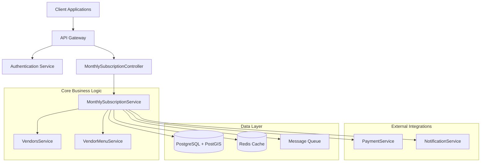
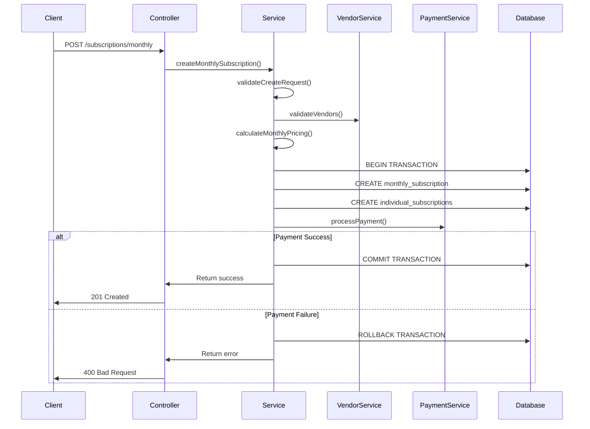
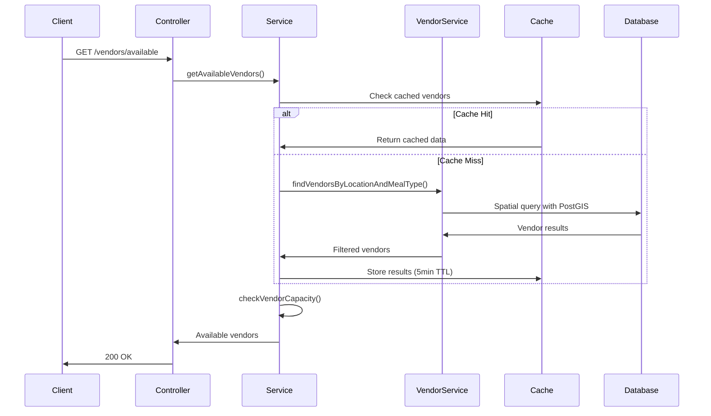
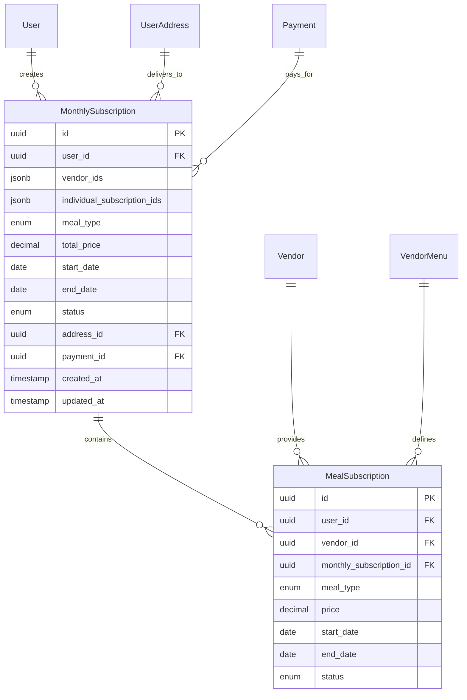

# Monthly Subscription System - Architecture Overview

This document provides a comprehensive architectural overview of the monthly subscription system, detailing the technical design, component interactions, and system-level decisions that enable users to select up to 4 vendors for monthly meal deliveries.

## 🎯 System Overview

The monthly subscription system is designed as a sophisticated multi-layered architecture that handles complex business logic while maintaining high performance, scalability, and reliability.

### Design Principles

- **Domain-Driven Design**: Business logic encapsulated in dedicated services
- **SOLID Principles**: Modular, testable, and maintainable code structure
- **Transaction Safety**: ACID compliance with rollback capabilities
- **Performance Optimization**: Caching, indexing, and query optimization
- **Security-First**: Authentication, authorization, and input validation
- **Comprehensive Testing**: 90%+ code coverage with unit, integration, and E2E tests

## 🏗️ System Architecture



## 📦 Component Architecture

### 1. Controller Layer (API Gateway)

**[`MonthlySubscriptionController`](../../src/meal-subscription/monthly-subscription.controller.ts)**

- **Responsibility**: HTTP request/response handling, input validation, authentication
- **Key Features**:
  - JWT authentication guard on all endpoints
  - Request/response DTO validation with class-validator
  - OpenAPI/Swagger documentation
  - Rate limiting and request throttling
  - Error handling and standardized responses

```typescript
@ApiTags('monthly-subscriptions')
@Controller('subscriptions')
@UseGuards(JwtAuthGuard)
@ApiBearerAuth('JWT-auth')
export class MonthlySubscriptionController {
  // 5 REST endpoints with comprehensive documentation
  // POST /subscriptions/monthly - Create subscription
  // GET /subscriptions/monthly/vendors/available - Get vendors
  // POST /subscriptions/monthly/validate - Validate selection  
  // POST /subscriptions/monthly/preview - Cost preview
  // GET /subscriptions/monthly/:id - Get subscription details
}
```

### 2. Service Layer (Business Logic)

**[`MonthlySubscriptionService`](../../src/meal-subscription/monthly-subscription.service.ts)**

- **Responsibility**: Core business logic, validation, orchestration
- **Key Components**:
  - Business rule validation (4-vendor limit, meal type consistency)
  - Geographic constraint checking (50km radius)
  - Vendor capacity and availability validation
  - Cost calculation with tax and fees
  - Transaction management with rollback capability
  - Individual subscription creation

```typescript
@Injectable()
export class MonthlySubscriptionService {
  // Core business methods
  async createMonthlySubscription(): Promise<MonthlySubscriptionResponseDto>
  async getAvailableVendors(): Promise<AvailableVendorsResponseDto>
  async validateMonthlySelection(): Promise<ValidationResultDto>
  async getMonthlyPreview(): Promise<MonthlyPreviewResponseDto>
  async findMonthlySubscription(): Promise<MonthlySubscriptionResponseDto>
  
  // Helper validation methods
  private validateCreateRequest()
  private validateVendorAvailability()
  private calculateMonthlyPricing()
  private checkVendorMonthlyCapacity()
}
```

### 3. Data Access Layer

**Entity Design**

- **[`MonthlySubscription`](../../src/meal-subscription/entities/monthly-subscription.entity.ts)**: Primary subscription entity
- **[`MealSubscription`](../../src/meal-subscription/entities/meal-subscription.entity.ts)**: Individual vendor subscriptions
- **Relationships**: Complex many-to-many through individual subscriptions

**Database Schema**

```sql
-- Optimized for query performance
CREATE INDEX idx_monthly_subscriptions_user_status ON monthly_subscriptions(user_id, status);
CREATE INDEX idx_monthly_subscriptions_meal_type ON monthly_subscriptions(meal_type);
CREATE INDEX idx_monthly_subscriptions_dates ON monthly_subscriptions(start_date, end_date);

-- JSONB indexing for vendor arrays
CREATE INDEX idx_monthly_subscriptions_vendor_ids ON monthly_subscriptions USING GIN(vendor_ids);
```

### 4. Integration Layer

**Vendor Integration**
- **[`VendorsService`](../../src/vendors/vendors.service.ts)**: Extended for monthly subscription support
- **Spatial Queries**: PostGIS for geographic filtering
- **Capacity Management**: Real-time availability checking

**Menu Integration**
- **[`VendorMenuService`](../../src/vendor-menu/vendor-menu.service.ts)**: Menu and pricing data
- **Price Calculation**: Weekly averages, monthly projections

**Payment Integration**
- **[`PaymentService`](../../src/payments/payments.service.ts)**: Payment processing
- **Transaction Safety**: Payment reversals on subscription failure

## 🔄 Request Flow Architecture

### 1. Create Monthly Subscription Flow



### 2. Vendor Search Flow



## 💾 Data Architecture

### Database Design Philosophy

- **PostgreSQL + PostGIS**: Spatial data support for geographic queries
- **TypeORM**: Object-relational mapping with advanced query capabilities
- **JSONB Storage**: Flexible vendor array storage with indexing
- **Normalization**: Balanced approach for performance and consistency

### Entity Relationships



### Query Optimization Strategy

**Spatial Queries**
```sql
-- Geographic vendor search with PostGIS
SELECT v.* FROM vendors v 
WHERE ST_DWithin(
  ST_GeomFromText('POINT(55.2708 25.2048)', 4326)::geography,
  ST_GeomFromText('POINT(' || v.longitude || ' ' || v.latitude || ')', 4326)::geography,
  50000  -- 50km radius
);
```

**JSONB Queries**
```sql
-- Vendor array queries
SELECT * FROM monthly_subscriptions 
WHERE vendor_ids @> '["550e8400-e29b-41d4-a716-446655440001"]';

-- Count vendor usage
SELECT vendor_id, COUNT(*) 
FROM (
  SELECT jsonb_array_elements_text(vendor_ids) as vendor_id 
  FROM monthly_subscriptions 
  WHERE status = 'ACTIVE'
) GROUP BY vendor_id;
```

## ⚡ Performance Architecture

### Caching Strategy

**Multi-Level Caching**
```typescript
// L1: Application-level caching
@Cacheable('vendors-monthly-selection', { ttl: 300 }) // 5 minutes
async getAvailableVendors(): Promise<VendorsResponse> {
  // Implementation
}

// L2: Redis caching for geographic queries
const cacheKey = `vendors:${lat}:${lng}:${mealType}:${radius}`;
const cachedResult = await this.redisService.get(cacheKey);

// L3: Database query result caching
// PostgreSQL shared_buffers and query plan caching
```

**Cache Invalidation**
- **Time-based**: Vendor data expires every 5 minutes
- **Event-based**: Vendor status changes trigger cache invalidation
- **Manual**: Admin tools for cache management

### Database Performance

**Index Strategy**
```sql
-- Composite indexes for common query patterns
CREATE INDEX idx_monthly_subs_user_status_date 
ON monthly_subscriptions(user_id, status, start_date);

-- Partial indexes for active subscriptions
CREATE INDEX idx_monthly_subs_active 
ON monthly_subscriptions(user_id, meal_type) 
WHERE status = 'ACTIVE';

-- GIN indexes for JSONB queries
CREATE INDEX idx_monthly_subs_vendor_ids 
ON monthly_subscriptions USING GIN(vendor_ids);
```

**Query Performance Monitoring**
- **pg_stat_statements**: Query performance tracking
- **Slow query logging**: Queries > 1000ms logged
- **Connection pooling**: TypeORM connection management
- **Query plan analysis**: Regular EXPLAIN ANALYZE reviews

## 🔒 Security Architecture

### Authentication & Authorization

**JWT-Based Authentication**
```typescript
@UseGuards(JwtAuthGuard)
@ApiBearerAuth('JWT-auth')
export class MonthlySubscriptionController {
  // All endpoints require valid JWT token
  // User identity extracted from token payload
  // Resource ownership validation enforced
}
```

**Authorization Layers**
1. **API Level**: JWT token validation
2. **Resource Level**: User ownership verification
3. **Business Logic**: Role-based access control
4. **Data Level**: Row-level security (future enhancement)

### Input Validation & Security

**Multi-Layer Validation**
```typescript
// DTO validation with class-validator
export class CreateMonthlySubscriptionDto {
  @IsArray()
  @ArrayMinSize(1)
  @ArrayMaxSize(4)
  @IsValidVendorSelection() // Custom business rule validator
  @IsUUID('4', { each: true })
  vendorIds: string[];
  
  @IsEnum(MealType)
  mealType: MealType;
  
  @IsFutureDate() // Custom date validator
  startDate: string;
}

// Business rule validation
private async validateCreateRequest(): Promise<void> {
  // Vendor existence, availability, meal type consistency
  // Geographic constraints, capacity limits
  // Date range validation, business hours
}
```

**Security Measures**
- **SQL Injection Prevention**: TypeORM parameterized queries
- **XSS Protection**: Input sanitization and output encoding
- **Rate Limiting**: API endpoint throttling
- **Audit Logging**: All subscription operations logged
- **Data Encryption**: Sensitive data encrypted at rest

## 🧪 Testing Architecture

### Test Strategy

**Comprehensive Testing Pyramid**
```
                    /\
                   /  \
                  / E2E \     <- End-to-End Tests
                 /      \     <- Complete workflows
                /________\
               /          \
              /Integration \   <- Integration Tests
             /    Tests     \  <- Service interactions
            /________________\
           /                  \
          /    Unit Tests      \ <- Unit Tests
         /  Business Logic     \ <- Service methods
        /______________________\ <- Pure functions
```

**Test Coverage Goals**
- **Statements**: 90%+
- **Branches**: 90%+
- **Functions**: 90%+
- **Lines**: 90%+

### Testing Infrastructure

**Test Data Management**
```typescript
// TestDataFactory for consistent test data
export class TestDataFactory {
  static createUser(): User
  static createVendor(): Vendor
  static createMonthlySubscription(): MonthlySubscription
  static createMockRepository<T>(): MockRepository<T>
  static createMockQueryRunner(): MockQueryRunner
}
```

**Testing Environments**
- **Unit Tests**: Mocked dependencies, isolated testing
- **Integration Tests**: Test database, real service interactions
- **E2E Tests**: Complete application stack, real database
- **Performance Tests**: Load testing, stress testing

## 📊 Monitoring & Observability

### Application Monitoring

**Key Metrics**
- **Business Metrics**: Subscription creation rate, vendor selection patterns
- **Technical Metrics**: API response times, error rates, database query performance
- **System Metrics**: CPU, memory, disk usage, connection pools

**Logging Strategy**
```typescript
// Structured logging with context
this.logger.log(`Creating monthly subscription for user ${userId} with ${vendorIds.length} vendors`, {
  userId,
  vendorCount: vendorIds.length,
  mealType: createDto.mealType,
  operation: 'CREATE_MONTHLY_SUBSCRIPTION'
});
```

### Health Checks

**Application Health**
```typescript
@Get('/health')
async healthCheck(): Promise<HealthCheckResult> {
  return this.healthCheck.check([
    () => this.db.pingCheck('database'),
    () => this.redis.pingCheck('redis'),
    () => this.vendorsService.healthCheck('vendors-service')
  ]);
}
```

**Database Health**
- **Connection pool status**: Active/idle connections
- **Query performance**: Average/maximum query times
- **Lock monitoring**: Database lock detection and alerting

## 🚀 Deployment Architecture

### Environment Strategy

**Multi-Environment Setup**
```
Development -> Staging -> Production
     |           |          |
     |           |          |
   Local DB -> Test DB -> Prod DB
   Mock APIs -> Sandbox -> Live APIs
```

**Configuration Management**
```typescript
// Environment-specific configuration
export interface AppConfig {
  database: DatabaseConfig;
  jwt: JWTConfig;
  business: {
    taxRate: number;
    deliveryRadiusKm: number;
    maxVendorsPerSubscription: number;
  };
}
```

### Scalability Considerations

**Horizontal Scaling**
- **Load Balancing**: Multiple application instances
- **Database Scaling**: Read replicas for query scaling
- **Cache Scaling**: Redis cluster for cache distribution
- **Queue Scaling**: Message queue for async processing

**Vertical Scaling**
- **Resource Monitoring**: CPU, memory, disk usage tracking
- **Performance Tuning**: Query optimization, index management
- **Capacity Planning**: Growth projections and scaling triggers

## 📋 Integration Points

### External System Integration

**Payment Gateway Integration**
```typescript
// Payment processing with fallback and retry logic
async processMonthlySubscriptionPayment(
  subscription: MonthlySubscription,
  paymentMethod: PaymentMethod
): Promise<Payment> {
  // Primary payment processor
  try {
    return await this.primaryPaymentProcessor.process(subscription, paymentMethod);
  } catch (error) {
    // Fallback to secondary processor
    return await this.fallbackPaymentProcessor.process(subscription, paymentMethod);
  }
}
```

**Notification System Integration**
```typescript
// Event-driven notifications
@EventPattern('monthly_subscription.created')
async handleSubscriptionCreated(data: MonthlySubscriptionCreatedEvent) {
  await this.notificationService.sendSubscriptionConfirmation(
    data.userId,
    data.subscriptionId
  );
}
```

### API Integration Points

**Vendor Management System**
- **Vendor data synchronization**: Real-time vendor status updates
- **Menu synchronization**: Price and availability updates
- **Capacity management**: Real-time slot availability

**User Management System**
- **Address validation**: Delivery address verification
- **Payment method validation**: Payment method verification
- **User preference management**: Meal type preferences, dietary restrictions

## 🔧 Development Architecture

### Code Organization

**Module Structure**
```
src/meal-subscription/
├── entities/              # Database entities
├── dto/                  # Data Transfer Objects
│   ├── request/         # Request DTOs
│   ├── response/        # Response DTOs
│   └── validators/      # Custom validators
├── services/            # Business logic services
├── controllers/         # HTTP controllers
├── __tests__/          # Comprehensive test suite
└── README.md           # Module documentation
```

**Dependency Injection**
```typescript
@Module({
  imports: [
    TypeOrmModule.forFeature([MonthlySubscription, MealSubscription]),
    VendorsModule,
    PaymentsModule,
    NotificationsModule
  ],
  controllers: [MonthlySubscriptionController],
  providers: [MonthlySubscriptionService],
  exports: [MonthlySubscriptionService]
})
export class MonthlySubscriptionModule {}
```

### Code Quality Standards

**Development Guidelines**
- **TypeScript Strict Mode**: Enabled for type safety
- **ESLint + Prettier**: Code formatting and linting
- **Conventional Commits**: Structured commit messages
- **Pull Request Reviews**: Mandatory code reviews
- **Documentation Requirements**: JSDoc for public APIs

**Quality Gates**
- **Test Coverage**: Minimum 90% required
- **Code Quality**: SonarQube analysis
- **Security Scan**: Automated vulnerability scanning
- **Performance Testing**: Load testing for critical paths

---

This architecture provides a solid foundation for the monthly subscription system with consideration for scalability, maintainability, security, and performance. The design supports current requirements while being flexible enough to accommodate future enhancements and growth.

**Last Updated**: 2025-08-28  
**Version**: 1.0.0  
**Maintained By**: Development Team