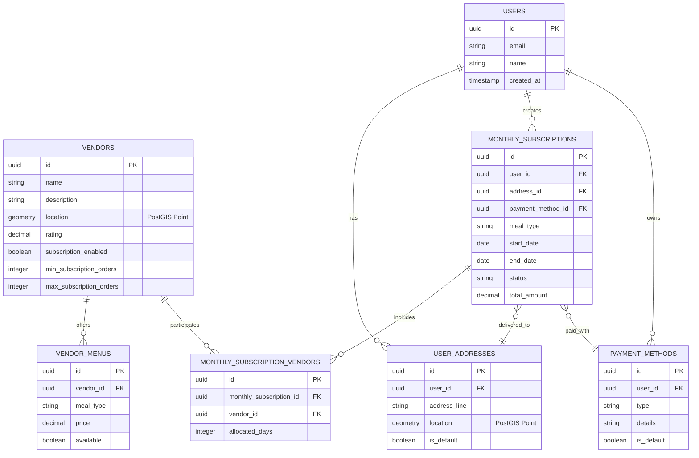

# Monthly Subscription Database Design

This document provides detailed technical documentation for the database design of the Monthly Subscription system, including entity relationships, schema design, indexing strategies, and spatial data handling.

## 🗂️ Database Schema Overview

### Technology Stack
- **Database**: PostgreSQL 14+
- **Extensions**: PostGIS (spatial data), UUID-OSSP (UUID generation)
- **ORM**: TypeORM with NestJS
- **Connection Pool**: Default PostgreSQL connection pooling
- **Backup Strategy**: Daily automated backups with 30-day retention

### Core Entities

```sql
-- Monthly Subscription Entity
CREATE TABLE monthly_subscriptions (
    id UUID PRIMARY KEY DEFAULT uuid_generate_v4(),
    user_id UUID NOT NULL REFERENCES users(id) ON DELETE CASCADE,
    meal_type VARCHAR(20) NOT NULL CHECK (meal_type IN ('BREAKFAST', 'LUNCH', 'DINNER')),
    start_date DATE NOT NULL,
    end_date DATE NOT NULL,
    status VARCHAR(20) NOT NULL DEFAULT 'PENDING' 
        CHECK (status IN ('PENDING', 'ACTIVE', 'PAUSED', 'CANCELLED', 'COMPLETED')),
    address_id UUID NOT NULL REFERENCES user_addresses(id),
    payment_method_id UUID NOT NULL REFERENCES payment_methods(id),
    total_amount DECIMAL(10,2) NOT NULL,
    created_at TIMESTAMP DEFAULT CURRENT_TIMESTAMP,
    updated_at TIMESTAMP DEFAULT CURRENT_TIMESTAMP,
    
    -- Constraints
    CONSTRAINT valid_date_range CHECK (end_date > start_date),
    CONSTRAINT positive_amount CHECK (total_amount > 0)
);

-- Monthly Subscription Vendors (Many-to-Many)
CREATE TABLE monthly_subscription_vendors (
    id UUID PRIMARY KEY DEFAULT uuid_generate_v4(),
    monthly_subscription_id UUID NOT NULL REFERENCES monthly_subscriptions(id) ON DELETE CASCADE,
    vendor_id UUID NOT NULL REFERENCES vendors(id) ON DELETE CASCADE,
    allocated_days INTEGER NOT NULL DEFAULT 0,
    created_at TIMESTAMP DEFAULT CURRENT_TIMESTAMP,
    
    -- Constraints
    UNIQUE(monthly_subscription_id, vendor_id),
    CONSTRAINT positive_days CHECK (allocated_days >= 0),
    CONSTRAINT max_allocated_days CHECK (allocated_days <= 31)
);

-- Vendor Entity (Enhanced for subscriptions)
ALTER TABLE vendors ADD COLUMN IF NOT EXISTS subscription_enabled BOOLEAN DEFAULT false;
ALTER TABLE vendors ADD COLUMN IF NOT EXISTS min_subscription_orders INTEGER DEFAULT 1;
ALTER TABLE vendors ADD COLUMN IF NOT EXISTS max_subscription_orders INTEGER DEFAULT 50;

-- User Addresses with Spatial Data
ALTER TABLE user_addresses ADD COLUMN IF NOT EXISTS location GEOMETRY(POINT, 4326);

-- Create spatial index for location-based queries
CREATE INDEX CONCURRENTLY IF NOT EXISTS idx_user_addresses_location 
ON user_addresses USING GIST (location);
```

## 🏗️ Entity Relationships

### Entity Relationship Diagram



### Relationship Details

1. **User → Monthly Subscriptions**: One-to-Many
   - Users can have multiple active subscriptions
   - Each subscription belongs to exactly one user
   - Cascade delete when user is removed

2. **Monthly Subscription → Vendors**: Many-to-Many
   - Through `monthly_subscription_vendors` junction table
   - Tracks allocated days per vendor
   - Maximum 4 vendors per subscription

3. **Vendor → Menu Items**: One-to-Many
   - Vendors offer multiple menu items
   - Menu items filtered by meal type for subscriptions

4. **User → Addresses**: One-to-Many
   - Users can have multiple delivery addresses
   - Each subscription uses one specific address
   - PostGIS spatial data for geographic queries

## 📊 Data Types & Constraints

### Custom Types

```sql
-- Enum types for type safety
CREATE TYPE meal_type_enum AS ENUM ('BREAKFAST', 'LUNCH', 'DINNER');
CREATE TYPE subscription_status_enum AS ENUM ('PENDING', 'ACTIVE', 'PAUSED', 'CANCELLED', 'COMPLETED');

-- Update tables to use enum types
ALTER TABLE monthly_subscriptions 
    ALTER COLUMN meal_type TYPE meal_type_enum USING meal_type::meal_type_enum;
    
ALTER TABLE monthly_subscriptions 
    ALTER COLUMN status TYPE subscription_status_enum USING status::subscription_status_enum;
```

### Validation Constraints

```sql
-- Business rule constraints
ALTER TABLE monthly_subscriptions 
ADD CONSTRAINT max_subscription_duration 
CHECK (end_date <= start_date + INTERVAL '1 year');

-- Vendor limit constraint (enforced at application level due to complexity)
-- Maximum 4 vendors per subscription validated in service layer

-- Geographic constraint function
CREATE OR REPLACE FUNCTION validate_vendor_coverage(
    subscription_id UUID,
    max_distance_km DECIMAL DEFAULT 50.0
) RETURNS BOOLEAN AS $$
DECLARE
    user_location GEOMETRY;
    vendor_count INTEGER;
BEGIN
    -- Get user location for subscription
    SELECT ua.location INTO user_location
    FROM monthly_subscriptions ms
    JOIN user_addresses ua ON ms.address_id = ua.id
    WHERE ms.id = subscription_id;
    
    -- Count vendors outside coverage area
    SELECT COUNT(*) INTO vendor_count
    FROM monthly_subscription_vendors msv
    JOIN vendors v ON msv.vendor_id = v.id
    WHERE msv.monthly_subscription_id = subscription_id
    AND ST_DWithin(
        user_location::geography,
        v.location::geography,
        max_distance_km * 1000  -- Convert to meters
    ) = false;
    
    RETURN vendor_count = 0;
END;
$$ LANGUAGE plpgsql;
```

## 🗺️ Spatial Data Implementation

### PostGIS Setup

```sql
-- Enable PostGIS extension
CREATE EXTENSION IF NOT EXISTS postgis;
CREATE EXTENSION IF NOT EXISTS postgis_topology;

-- Create spatial reference system function
CREATE OR REPLACE FUNCTION ensure_spatial_index(table_name TEXT, column_name TEXT)
RETURNS VOID AS $$
BEGIN
    EXECUTE format('CREATE INDEX CONCURRENTLY IF NOT EXISTS idx_%I_%I_gist 
                   ON %I USING GIST (%I)', 
                   table_name, column_name, table_name, column_name);
END;
$$ LANGUAGE plpgsql;

-- Apply spatial indexing
SELECT ensure_spatial_index('vendors', 'location');
SELECT ensure_spatial_index('user_addresses', 'location');
```

### Geographic Query Examples

```sql
-- Find vendors within 50km of user address
WITH user_location AS (
    SELECT ua.location
    FROM user_addresses ua
    WHERE ua.id = $1
)
SELECT 
    v.id,
    v.name,
    v.rating,
    ST_Distance(v.location::geography, ul.location::geography) / 1000 AS distance_km
FROM vendors v, user_location ul
WHERE ST_DWithin(
    v.location::geography,
    ul.location::geography,
    50000  -- 50km in meters
)
AND v.subscription_enabled = true
ORDER BY distance_km ASC;

-- Validate subscription vendor coverage
SELECT 
    ms.id AS subscription_id,
    COUNT(msv.vendor_id) AS vendor_count,
    BOOL_AND(
        ST_DWithin(
            ua.location::geography,
            v.location::geography,
            50000  -- 50km radius
        )
    ) AS all_vendors_in_range
FROM monthly_subscriptions ms
JOIN user_addresses ua ON ms.address_id = ua.id
JOIN monthly_subscription_vendors msv ON ms.id = msv.monthly_subscription_id
JOIN vendors v ON msv.vendor_id = v.id
WHERE ms.id = $1
GROUP BY ms.id, ua.location;
```

## 🔍 Indexing Strategy

### Primary Indexes

```sql
-- Primary keys (automatic)
-- monthly_subscriptions(id)
-- monthly_subscription_vendors(id)

-- Foreign key indexes for performance
CREATE INDEX CONCURRENTLY IF NOT EXISTS idx_monthly_subscriptions_user_id 
ON monthly_subscriptions (user_id);

CREATE INDEX CONCURRENTLY IF NOT EXISTS idx_monthly_subscriptions_status 
ON monthly_subscriptions (status);

CREATE INDEX CONCURRENTLY IF NOT EXISTS idx_monthly_subscriptions_date_range 
ON monthly_subscriptions (start_date, end_date);

CREATE INDEX CONCURRENTLY IF NOT EXISTS idx_monthly_subscription_vendors_subscription_id 
ON monthly_subscription_vendors (monthly_subscription_id);

CREATE INDEX CONCURRENTLY IF NOT EXISTS idx_monthly_subscription_vendors_vendor_id 
ON monthly_subscription_vendors (vendor_id);
```

### Composite Indexes

```sql
-- Query optimization indexes
CREATE INDEX CONCURRENTLY IF NOT EXISTS idx_monthly_subscriptions_user_status 
ON monthly_subscriptions (user_id, status);

CREATE INDEX CONCURRENTLY IF NOT EXISTS idx_monthly_subscriptions_meal_type_status 
ON monthly_subscriptions (meal_type, status);

CREATE INDEX CONCURRENTLY IF NOT EXISTS idx_vendors_subscription_enabled_meal_type 
ON vendors (subscription_enabled, meal_type);

-- Spatial indexes
CREATE INDEX CONCURRENTLY IF NOT EXISTS idx_vendors_location_subscription 
ON vendors USING GIST (location) 
WHERE subscription_enabled = true;
```

### Partial Indexes

```sql
-- Index only active subscriptions for performance
CREATE INDEX CONCURRENTLY IF NOT EXISTS idx_active_subscriptions 
ON monthly_subscriptions (user_id, start_date, end_date) 
WHERE status = 'ACTIVE';

-- Index subscription-enabled vendors only
CREATE INDEX CONCURRENTLY IF NOT EXISTS idx_subscription_vendors_location 
ON vendors USING GIST (location) 
WHERE subscription_enabled = true;
```

## 📈 Performance Optimization

### Query Optimization

```sql
-- Materialized view for vendor statistics
CREATE MATERIALIZED VIEW vendor_subscription_stats AS
SELECT 
    v.id,
    v.name,
    COUNT(msv.id) AS total_subscriptions,
    AVG(ms.total_amount) AS avg_subscription_amount,
    COUNT(DISTINCT ms.user_id) AS unique_subscribers
FROM vendors v
LEFT JOIN monthly_subscription_vendors msv ON v.id = msv.vendor_id
LEFT JOIN monthly_subscriptions ms ON msv.monthly_subscription_id = ms.id
WHERE v.subscription_enabled = true
GROUP BY v.id, v.name;

-- Refresh strategy
CREATE OR REPLACE FUNCTION refresh_vendor_stats()
RETURNS VOID AS $$
BEGIN
    REFRESH MATERIALIZED VIEW CONCURRENTLY vendor_subscription_stats;
END;
$$ LANGUAGE plpgsql;

-- Schedule refresh (via cron job)
-- 0 2 * * * psql -d messapp -c "SELECT refresh_vendor_stats();"
```

### Connection Pool Configuration

```typescript
// TypeORM configuration for optimal performance
export const databaseConfig: TypeOrmModuleOptions = {
  type: 'postgres',
  host: process.env.DB_HOST,
  port: parseInt(process.env.DB_PORT, 10),
  username: process.env.DB_USERNAME,
  password: process.env.DB_PASSWORD,
  database: process.env.DB_DATABASE,
  
  // Connection pool settings
  extra: {
    max: 20,                    // Maximum pool size
    min: 5,                     // Minimum pool size
    idle: 10000,               // Close connections after 10s idle
    acquire: 30000,            // Max time to get connection
    connectionTimeoutMillis: 5000,
    idleTimeoutMillis: 30000,
    
    // Performance optimizations
    application_name: 'mess_app_backend',
    statement_timeout: '30s',
    lock_timeout: '10s',
    idle_in_transaction_session_timeout: '30s'
  },
  
  logging: process.env.NODE_ENV === 'development',
  synchronize: false,          // Always false in production
  migrationsRun: true,
  entities: ['dist/**/*.entity{.ts,.js}'],
  migrations: ['dist/migrations/*{.ts,.js}']
};
```

## 🔒 Data Security & Privacy

### Row Level Security (RLS)

```sql
-- Enable RLS on sensitive tables
ALTER TABLE monthly_subscriptions ENABLE ROW LEVEL SECURITY;
ALTER TABLE user_addresses ENABLE ROW LEVEL SECURITY;

-- Users can only access their own subscriptions
CREATE POLICY user_subscription_policy ON monthly_subscriptions
FOR ALL TO application_user
USING (user_id = current_setting('app.current_user_id')::UUID);

-- Users can only access their own addresses
CREATE POLICY user_address_policy ON user_addresses
FOR ALL TO application_user
USING (user_id = current_setting('app.current_user_id')::UUID);
```

### Data Encryption

```sql
-- Encrypt sensitive fields (application level)
-- Payment method details encrypted before storage
-- Personal information encrypted at rest

-- Audit trail table
CREATE TABLE subscription_audit (
    id UUID PRIMARY KEY DEFAULT uuid_generate_v4(),
    table_name VARCHAR(50) NOT NULL,
    record_id UUID NOT NULL,
    action VARCHAR(20) NOT NULL,
    old_values JSONB,
    new_values JSONB,
    user_id UUID,
    timestamp TIMESTAMP DEFAULT CURRENT_TIMESTAMP
);
```

## 🚀 Migration Scripts

### Initial Schema Migration

```sql
-- Migration: 1724827800000-CreateMonthlySubscriptions.ts
-- This migration creates all core tables and constraints

DO $$
BEGIN
    -- Create tables if they don't exist
    IF NOT EXISTS (SELECT FROM pg_tables WHERE tablename = 'monthly_subscriptions') THEN
        -- Table creation SQL from above
        RAISE NOTICE 'Creating monthly_subscriptions table...';
    END IF;
    
    -- Add indexes
    PERFORM 'CREATE INDEX CONCURRENTLY IF NOT EXISTS ' || index_name
    FROM (VALUES 
        ('idx_monthly_subscriptions_user_id'),
        ('idx_monthly_subscriptions_status'),
        ('idx_monthly_subscription_vendors_subscription_id')
    ) AS indexes(index_name);
    
    RAISE NOTICE 'Monthly subscriptions schema migration completed.';
END
$$;
```

### Data Migration Scripts

```sql
-- Migrate existing users to support subscriptions
UPDATE users SET 
    subscription_eligible = true,
    subscription_tier = 'BASIC'
WHERE created_at < CURRENT_DATE - INTERVAL '30 days'
AND total_orders >= 10;

-- Initialize vendor subscription settings
UPDATE vendors SET
    subscription_enabled = true,
    min_subscription_orders = 5,
    max_subscription_orders = 30
WHERE rating >= 4.0
AND total_orders >= 100;
```

## 📊 Database Monitoring

### Key Metrics to Monitor

```sql
-- Active subscription count
SELECT 
    status,
    COUNT(*) as count,
    SUM(total_amount) as total_revenue
FROM monthly_subscriptions 
GROUP BY status;

-- Vendor subscription participation
SELECT 
    v.name,
    COUNT(msv.id) as subscription_count,
    AVG(ms.total_amount) as avg_revenue_per_subscription
FROM vendors v
LEFT JOIN monthly_subscription_vendors msv ON v.id = msv.vendor_id
LEFT JOIN monthly_subscriptions ms ON msv.monthly_subscription_id = ms.id
WHERE v.subscription_enabled = true
GROUP BY v.id, v.name
ORDER BY subscription_count DESC;

-- Geographic distribution
SELECT 
    ST_AsText(ST_Centroid(ST_Union(ua.location))) as center_point,
    COUNT(*) as subscription_count
FROM monthly_subscriptions ms
JOIN user_addresses ua ON ms.address_id = ua.id
WHERE ms.status = 'ACTIVE'
GROUP BY ST_SnapToGrid(ua.location, 0.01); -- Group by ~1km grid
```

### Performance Monitoring Queries

```sql
-- Slow query identification
SELECT 
    query,
    calls,
    total_time,
    mean_time,
    rows
FROM pg_stat_statements 
WHERE query LIKE '%monthly_subscription%'
ORDER BY mean_time DESC
LIMIT 10;

-- Index usage analysis
SELECT 
    schemaname,
    tablename,
    indexname,
    idx_tup_read,
    idx_tup_fetch,
    idx_tup_read / NULLIF(idx_tup_fetch, 0) as selectivity
FROM pg_stat_user_indexes 
WHERE tablename LIKE '%monthly_subscription%'
ORDER BY idx_tup_read DESC;
```

## 🏗️ Backup & Recovery

### Backup Strategy

```bash
#!/bin/bash
# Daily backup script for monthly subscription data

# Full database backup
pg_dump -h $DB_HOST -U $DB_USER -d $DB_NAME \
    --verbose --clean --no-acl --no-owner \
    -f /backups/messapp_$(date +%Y%m%d_%H%M%S).sql

# Table-specific backups for critical data
pg_dump -h $DB_HOST -U $DB_USER -d $DB_NAME \
    -t monthly_subscriptions \
    -t monthly_subscription_vendors \
    -t users \
    -t vendors \
    --data-only --inserts \
    -f /backups/subscription_data_$(date +%Y%m%d).sql

# Spatial data backup
pg_dump -h $DB_HOST -U $DB_USER -d $DB_NAME \
    -t user_addresses \
    -t vendors \
    --column-inserts --no-privileges \
    -f /backups/spatial_data_$(date +%Y%m%d).sql
```

### Recovery Procedures

```sql
-- Point-in-time recovery for subscription data
-- 1. Stop application servers
-- 2. Restore from latest base backup
-- 3. Apply WAL files up to specific timestamp

-- Data consistency checks after recovery
SELECT 
    ms.id,
    ms.user_id,
    COUNT(msv.vendor_id) as vendor_count,
    CASE 
        WHEN COUNT(msv.vendor_id) > 4 THEN 'INVALID - Too many vendors'
        WHEN COUNT(msv.vendor_id) = 0 THEN 'INVALID - No vendors'
        ELSE 'VALID'
    END as validation_status
FROM monthly_subscriptions ms
LEFT JOIN monthly_subscription_vendors msv ON ms.id = msv.monthly_subscription_id
GROUP BY ms.id, ms.user_id
HAVING COUNT(msv.vendor_id) = 0 OR COUNT(msv.vendor_id) > 4;
```

---

**Database Schema Version**: 1.2.0  
**Last Updated**: 2025-08-28  
**Next Review**: 2025-09-28  
**Maintained By**: Backend Engineering Team

*This document is maintained alongside database migrations and updated with each schema change.*