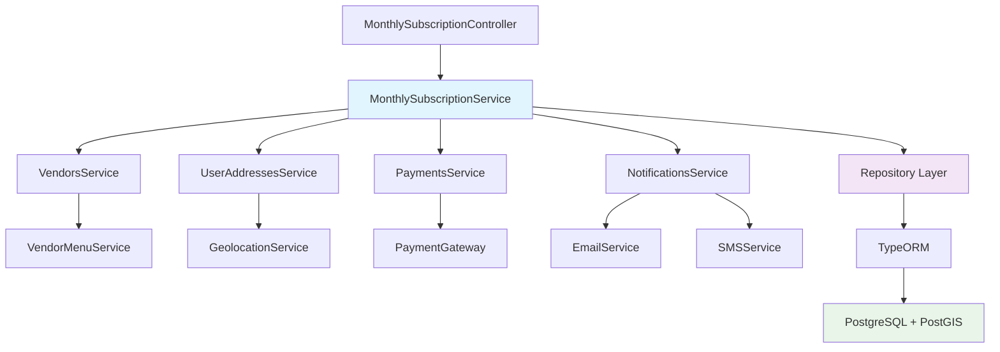

# Monthly Subscription Service Architecture

This document provides detailed technical documentation for the service layer architecture of the Monthly Subscription system, including service design patterns, dependency injection, transaction management, and integration points.

## 🏗️ Service Layer Overview

### Architecture Principles
- **Single Responsibility**: Each service handles one specific business domain
- **Dependency Injection**: Loose coupling through NestJS dependency injection
- **Transaction Management**: ACID compliance with database transactions
- **Error Handling**: Centralized error handling and logging
- **Testing**: High test coverage with unit and integration tests

### Service Hierarchy

```typescript
// Core service structure
@Injectable()
export class MonthlySubscriptionService {
  constructor(
    private readonly monthlySubscriptionRepo: Repository<MonthlySubscription>,
    private readonly vendorService: VendorsService,
    private readonly userAddressService: UserAddressesService,
    private readonly paymentsService: PaymentsService,
    private readonly notificationService: NotificationsService,
    private readonly logger: Logger
  ) {}
}
```

## 📋 Service Dependencies

### Dependency Graph



### Service Interfaces

```typescript
// Core service interface
export interface IMonthlySubscriptionService {
  createSubscription(userId: string, data: CreateMonthlySubscriptionDto): Promise<MonthlySubscriptionResponseDto>;
  getAvailableVendors(query: AvailableVendorsQueryDto): Promise<AvailableVendorsResponseDto>;
  validateSelection(data: ValidateMonthlySelectionDto): Promise<ValidationResultDto>;
  getMonthlyPreview(query: MonthlyPreviewQueryDto): Promise<MonthlyPreviewResponseDto>;
  getUserSubscriptions(userId: string): Promise<MonthlySubscriptionSummaryDto[]>;
}

// Supporting service interfaces
export interface IVendorsService {
  findAvailableForSubscription(location: Point, mealType: MealType, radius: number): Promise<Vendor[]>;
  validateVendorCompatibility(vendorIds: string[], mealType: MealType): Promise<boolean>;
  calculateDeliveryCoverage(vendorIds: string[], userLocation: Point): Promise<CoverageResult>;
}

export interface IUserAddressesService {
  findUserAddress(userId: string, addressId: string): Promise<UserAddress>;
  validateAddressForDelivery(addressId: string): Promise<boolean>;
  getLocationPoint(addressId: string): Promise<Point>;
}

export interface IPaymentsService {
  validatePaymentMethod(userId: string, paymentMethodId: string): Promise<boolean>;
  processSubscriptionPayment(subscriptionId: string, amount: number): Promise<PaymentResult>;
  calculateSubscriptionCost(vendorIds: string[], mealType: MealType): Promise<CostBreakdown>;
}
```

## 🔄 Core Service Implementation

### MonthlySubscriptionService

```typescript
import { Injectable, Logger, BadRequestException, NotFoundException } from '@nestjs/common';
import { InjectRepository } from '@nestjs/typeorm';
import { Repository, EntityManager } from 'typeorm';

@Injectable()
export class MonthlySubscriptionService implements IMonthlySubscriptionService {
  private readonly logger = new Logger(MonthlySubscriptionService.name);

  constructor(
    @InjectRepository(MonthlySubscription)
    private readonly monthlySubscriptionRepository: Repository<MonthlySubscription>,
    
    @InjectRepository(MonthlySubscriptionVendor)
    private readonly subscriptionVendorRepository: Repository<MonthlySubscriptionVendor>,
    
    private readonly vendorsService: VendorsService,
    private readonly userAddressService: UserAddressesService,
    private readonly paymentsService: PaymentsService,
    private readonly notificationService: NotificationsService,
    private readonly entityManager: EntityManager
  ) {}

  /**
   * Creates a new monthly subscription with full transaction support
   */
  async createSubscription(
    userId: string,
    data: CreateMonthlySubscriptionDto
  ): Promise<MonthlySubscriptionResponseDto> {
    this.logger.log(`Creating monthly subscription for user ${userId}`);

    return await this.entityManager.transaction(async (transactionManager) => {
      try {
        // Step 1: Validate business rules
        await this.validateSubscriptionCreation(userId, data);

        // Step 2: Calculate costs
        const costBreakdown = await this.paymentsService.calculateSubscriptionCost(
          data.vendorIds,
          data.mealType
        );

        // Step 3: Create subscription entity
        const subscription = await this.createSubscriptionEntity(
          userId,
          data,
          costBreakdown,
          transactionManager
        );

        // Step 4: Associate vendors
        await this.associateVendorsWithSubscription(
          subscription.id,
          data.vendorIds,
          transactionManager
        );

        // Step 5: Process payment
        const paymentResult = await this.paymentsService.processSubscriptionPayment(
          subscription.id,
          costBreakdown.total
        );

        if (!paymentResult.success) {
          throw new BadRequestException(`Payment failed: ${paymentResult.error}`);
        }

        // Step 6: Update subscription status
        subscription.status = SubscriptionStatus.ACTIVE;
        await transactionManager.save(subscription);

        // Step 7: Send notifications (async, outside transaction)
        setImmediate(() => {
          this.notificationService.sendSubscriptionConfirmation(subscription);
        });

        this.logger.log(`Successfully created subscription ${subscription.id} for user ${userId}`);

        return this.mapToResponseDto(subscription);

      } catch (error) {
        this.logger.error(`Failed to create subscription for user ${userId}: ${error.message}`);
        throw error;
      }
    });
  }

  /**
   * Retrieves available vendors for subscription based on location and preferences
   */
  async getAvailableVendors(
    query: AvailableVendorsQueryDto
  ): Promise<AvailableVendorsResponseDto> {
    this.logger.log(`Searching vendors for location: ${query.latitude}, ${query.longitude}`);

    const userLocation: Point = {
      type: 'Point',
      coordinates: [query.longitude, query.latitude]
    };

    // Get vendors within radius
    const vendors = await this.vendorsService.findAvailableForSubscription(
      userLocation,
      query.mealType,
      query.radius || 15
    );

    // Filter by availability and ratings
    const filteredVendors = vendors.filter(vendor => 
      vendor.subscriptionEnabled && 
      vendor.rating >= 4.0 &&
      vendor.isActive
    );

    // Apply pagination
    const startIndex = ((query.page || 1) - 1) * (query.limit || 20);
    const endIndex = startIndex + (query.limit || 20);
    const paginatedVendors = filteredVendors.slice(startIndex, endIndex);

    this.logger.log(`Found ${filteredVendors.length} available vendors`);

    return {
      vendors: paginatedVendors.map(this.mapVendorToSummary),
      pagination: {
        page: query.page || 1,
        limit: query.limit || 20,
        total: filteredVendors.length,
        totalPages: Math.ceil(filteredVendors.length / (query.limit || 20))
      },
      filters: {
        mealType: query.mealType,
        radius: query.radius || 15,
        location: { latitude: query.latitude, longitude: query.longitude }
      }
    };
  }

  /**
   * Validates vendor selection for subscription compatibility
   */
  async validateSelection(
    data: ValidateMonthlySelectionDto
  ): Promise<ValidationResultDto> {
    this.logger.log(`Validating selection for ${data.vendorIds.length} vendors`);

    const errors: string[] = [];
    const warnings: string[] = [];

    try {
      // Rule 1: Maximum 4 vendors
      if (data.vendorIds.length > 4) {
        errors.push('Maximum 4 vendors allowed per subscription');
      }

      // Rule 2: Minimum 1 vendor
      if (data.vendorIds.length === 0) {
        errors.push('At least one vendor must be selected');
      }

      // Rule 3: Validate vendor compatibility
      const vendorCompatible = await this.vendorsService.validateVendorCompatibility(
        data.vendorIds,
        data.mealType
      );

      if (!vendorCompatible) {
        errors.push('Selected vendors do not all serve the requested meal type');
      }

      // Rule 4: Validate delivery coverage
      const userLocation: Point = {
        type: 'Point',
        coordinates: [data.userLocation.longitude, data.userLocation.latitude]
      };

      const coverageResult = await this.vendorsService.calculateDeliveryCoverage(
        data.vendorIds,
        userLocation
      );

      if (!coverageResult.allCovered) {
        errors.push(`Some vendors do not deliver to your location. Uncovered vendors: ${coverageResult.uncoveredVendors.join(', ')}`);
      }

      // Rule 5: Check vendor availability
      const vendors = await this.vendorsService.findByIds(data.vendorIds);
      const unavailableVendors = vendors.filter(v => !v.subscriptionEnabled || !v.isActive);
      
      if (unavailableVendors.length > 0) {
        errors.push(`Some vendors are not available for subscriptions: ${unavailableVendors.map(v => v.name).join(', ')}`);
      }

      // Warnings for optimization
      if (data.vendorIds.length === 1) {
        warnings.push('Consider adding more vendors for variety');
      }

      const isValid = errors.length === 0;

      this.logger.log(`Validation ${isValid ? 'passed' : 'failed'} with ${errors.length} errors`);

      return {
        isValid,
        errors,
        warnings,
        recommendedVendors: isValid ? [] : await this.getRecommendedAlternatives(data)
      };

    } catch (error) {
      this.logger.error(`Validation failed: ${error.message}`);
      return {
        isValid: false,
        errors: ['Validation service temporarily unavailable'],
        warnings: [],
        recommendedVendors: []
      };
    }
  }

  /**
   * Generates cost preview for subscription
   */
  async getMonthlyPreview(
    query: MonthlyPreviewQueryDto
  ): Promise<MonthlyPreviewResponseDto> {
    this.logger.log(`Generating preview for ${query.vendorIds.split(',').length} vendors`);

    const vendorIds = query.vendorIds.split(',').filter(id => id.trim());
    
    if (vendorIds.length === 0) {
      throw new BadRequestException('At least one vendor ID must be provided');
    }

    try {
      // Calculate cost breakdown
      const costBreakdown = await this.paymentsService.calculateSubscriptionCost(
        vendorIds,
        query.mealType
      );

      // Get vendor details
      const vendors = await this.vendorsService.findByIds(vendorIds);
      const vendorSummaries = vendors.map(this.mapVendorToSummary);

      // Calculate delivery schedule
      const deliverySchedule = await this.generateDeliverySchedule(
        vendorIds,
        query.startDate
      );

      this.logger.log(`Preview generated: total cost AED ${costBreakdown.total}`);

      return {
        costBreakdown,
        vendors: vendorSummaries,
        deliverySchedule,
        subscriptionPeriod: {
          startDate: query.startDate,
          endDate: this.calculateEndDate(query.startDate)
        },
        estimatedSavings: await this.calculateEstimatedSavings(vendorIds, query.mealType)
      };

    } catch (error) {
      this.logger.error(`Preview generation failed: ${error.message}`);
      throw new BadRequestException(`Unable to generate preview: ${error.message}`);
    }
  }

  // Private helper methods

  private async validateSubscriptionCreation(
    userId: string,
    data: CreateMonthlySubscriptionDto
  ): Promise<void> {
    // Validate user address
    const userAddress = await this.userAddressService.findUserAddress(userId, data.addressId);
    if (!userAddress) {
      throw new NotFoundException('User address not found');
    }

    // Validate payment method
    const paymentValid = await this.paymentsService.validatePaymentMethod(userId, data.paymentMethodId);
    if (!paymentValid) {
      throw new BadRequestException('Invalid payment method');
    }

    // Validate vendor selection
    const validationResult = await this.validateSelection({
      vendorIds: data.vendorIds,
      mealType: data.mealType,
      startDate: data.startDate,
      userLocation: {
        latitude: userAddress.latitude,
        longitude: userAddress.longitude
      }
    });

    if (!validationResult.isValid) {
      throw new BadRequestException(`Subscription validation failed: ${validationResult.errors.join(', ')}`);
    }
  }

  private async createSubscriptionEntity(
    userId: string,
    data: CreateMonthlySubscriptionDto,
    costBreakdown: CostBreakdown,
    transactionManager: EntityManager
  ): Promise<MonthlySubscription> {
    const subscription = transactionManager.create(MonthlySubscription, {
      userId,
      mealType: data.mealType,
      startDate: new Date(data.startDate),
      endDate: this.calculateEndDate(data.startDate),
      status: SubscriptionStatus.PENDING,
      addressId: data.addressId,
      paymentMethodId: data.paymentMethodId,
      totalAmount: costBreakdown.total
    });

    return await transactionManager.save(subscription);
  }

  private async associateVendorsWithSubscription(
    subscriptionId: string,
    vendorIds: string[],
    transactionManager: EntityManager
  ): Promise<void> {
    const allocatedDays = this.distributeVendorDays(vendorIds.length);
    
    for (let i = 0; i < vendorIds.length; i++) {
      const subscriptionVendor = transactionManager.create(MonthlySubscriptionVendor, {
        monthlySubscriptionId: subscriptionId,
        vendorId: vendorIds[i],
        allocatedDays: allocatedDays[i]
      });
      
      await transactionManager.save(subscriptionVendor);
    }
  }

  private distributeVendorDays(vendorCount: number): number[] {
    const totalDays = 22; // Approximate working days in a month
    const baseDays = Math.floor(totalDays / vendorCount);
    const extraDays = totalDays % vendorCount;
    
    const distribution = new Array(vendorCount).fill(baseDays);
    for (let i = 0; i < extraDays; i++) {
      distribution[i] += 1;
    }
    
    return distribution;
  }

  private calculateEndDate(startDate: string): Date {
    const start = new Date(startDate);
    const end = new Date(start);
    end.setMonth(end.getMonth() + 1);
    return end;
  }

  private mapVendorToSummary(vendor: Vendor): VendorSummary {
    return {
      id: vendor.id,
      name: vendor.name,
      description: vendor.description,
      rating: vendor.rating,
      distance: vendor.distance,
      averagePrice: vendor.averagePrice,
      cuisine: vendor.cuisine,
      imageUrl: vendor.imageUrl
    };
  }

  private mapToResponseDto(subscription: MonthlySubscription): MonthlySubscriptionResponseDto {
    return {
      id: subscription.id,
      userId: subscription.userId,
      vendors: subscription.vendors?.map(v => this.mapVendorToSummary(v.vendor)) || [],
      mealType: subscription.mealType,
      startDate: subscription.startDate.toISOString().split('T')[0],
      endDate: subscription.endDate.toISOString().split('T')[0],
      status: subscription.status,
      paymentSummary: {
        totalAmount: subscription.totalAmount,
        currency: 'AED',
        paymentMethod: subscription.paymentMethod?.type || 'Unknown'
      },
      createdAt: subscription.createdAt.toISOString(),
      updatedAt: subscription.updatedAt.toISOString()
    };
  }
}
```

## 🔧 Supporting Services

### VendorsService Integration

```typescript
@Injectable()
export class VendorsService {
  constructor(
    @InjectRepository(Vendor)
    private readonly vendorRepository: Repository<Vendor>,
    private readonly logger: Logger
  ) {}

  /**
   * Find vendors available for subscription within specified radius
   */
  async findAvailableForSubscription(
    location: Point,
    mealType: MealType,
    radiusKm: number
  ): Promise<Vendor[]> {
    const query = this.vendorRepository
      .createQueryBuilder('vendor')
      .leftJoinAndSelect('vendor.menus', 'menu')
      .where('vendor.subscriptionEnabled = :enabled', { enabled: true })
      .andWhere('vendor.isActive = :active', { active: true })
      .andWhere('menu.mealType = :mealType', { mealType })
      .andWhere('menu.available = :available', { available: true })
      .andWhere(
        `ST_DWithin(
          vendor.location::geography,
          ST_GeogFromText(:location),
          :radius
        )`,
        {
          location: `POINT(${location.coordinates[0]} ${location.coordinates[1]})`,
          radius: radiusKm * 1000 // Convert to meters
        }
      )
      .addSelect(
        `ST_Distance(
          vendor.location::geography,
          ST_GeogFromText(:location)
        ) / 1000`,
        'distance'
      )
      .orderBy('distance', 'ASC')
      .addOrderBy('vendor.rating', 'DESC');

    return await query.getMany();
  }

  /**
   * Validate that all vendors serve the specified meal type
   */
  async validateVendorCompatibility(vendorIds: string[], mealType: MealType): Promise<boolean> {
    const incompatibleCount = await this.vendorRepository
      .createQueryBuilder('vendor')
      .leftJoin('vendor.menus', 'menu')
      .where('vendor.id IN (:...vendorIds)', { vendorIds })
      .andWhere('vendor.subscriptionEnabled = :enabled', { enabled: true })
      .andWhere('menu.mealType != :mealType OR menu.mealType IS NULL', { mealType })
      .getCount();

    return incompatibleCount === 0;
  }

  /**
   * Calculate delivery coverage for selected vendors
   */
  async calculateDeliveryCoverage(
    vendorIds: string[], 
    userLocation: Point
  ): Promise<CoverageResult> {
    const vendors = await this.vendorRepository
      .createQueryBuilder('vendor')
      .where('vendor.id IN (:...vendorIds)', { vendorIds })
      .addSelect(
        `ST_Distance(
          vendor.location::geography,
          ST_GeogFromText(:location)
        ) / 1000`,
        'distance'
      )
      .setParameter('location', `POINT(${userLocation.coordinates[0]} ${userLocation.coordinates[1]})`)
      .getRawAndEntities();

    const maxDeliveryRadius = 50; // km
    const uncoveredVendors: string[] = [];

    vendors.raw.forEach((raw, index) => {
      if (raw.distance > maxDeliveryRadius) {
        uncoveredVendors.push(vendors.entities[index].name);
      }
    });

    return {
      allCovered: uncoveredVendors.length === 0,
      uncoveredVendors,
      coveragePercentage: ((vendorIds.length - uncoveredVendors.length) / vendorIds.length) * 100
    };
  }
}
```

### PaymentsService Integration

```typescript
@Injectable()
export class PaymentsService {
  constructor(
    @InjectRepository(PaymentMethod)
    private readonly paymentMethodRepository: Repository<PaymentMethod>,
    private readonly paymentGateway: PaymentGatewayService,
    private readonly logger: Logger
  ) {}

  /**
   * Calculate subscription cost breakdown
   */
  async calculateSubscriptionCost(
    vendorIds: string[],
    mealType: MealType
  ): Promise<CostBreakdown> {
    // Base subscription fee
    const baseSubscriptionFee = 50; // AED

    // Calculate vendor-specific costs
    const vendorCosts = await Promise.all(
      vendorIds.map(vendorId => this.calculateVendorCost(vendorId, mealType))
    );

    const subtotal = vendorCosts.reduce((sum, cost) => sum + cost.totalCost, baseSubscriptionFee);
    const serviceFeePct = vendorIds.length <= 2 ? 0.03 : 0.05;
    const serviceFee = subtotal * serviceFeePct;
    const total = subtotal + serviceFee;

    return {
      baseSubscriptionFee,
      vendorCosts,
      subtotal,
      serviceFee,
      total,
      currency: 'AED'
    };
  }

  private async calculateVendorCost(vendorId: string, mealType: MealType): Promise<VendorCost> {
    const vendor = await this.vendorRepository
      .createQueryBuilder('vendor')
      .leftJoinAndSelect('vendor.menus', 'menu')
      .where('vendor.id = :vendorId', { vendorId })
      .andWhere('menu.mealType = :mealType', { mealType })
      .getOne();

    if (!vendor || !vendor.menus?.length) {
      throw new NotFoundException(`Vendor ${vendorId} not found or no menu available for ${mealType}`);
    }

    const averagePrice = vendor.menus.reduce((sum, menu) => sum + menu.price, 0) / vendor.menus.length;
    const estimatedMealsPerMonth = this.calculateEstimatedMeals(vendorId);

    return {
      vendorId: vendor.id,
      vendorName: vendor.name,
      averagePrice,
      estimatedMeals: estimatedMealsPerMonth,
      totalCost: averagePrice * estimatedMealsPerMonth
    };
  }
}
```

## 📊 Performance Monitoring

### Service Metrics

```typescript
@Injectable()
export class PerformanceMonitoringService {
  private readonly metrics = new Map<string, MethodMetrics>();

  /**
   * Decorator for monitoring service method performance
   */
  @MethodMonitor()
  async monitoredMethod<T>(
    methodName: string,
    operation: () => Promise<T>
  ): Promise<T> {
    const startTime = Date.now();
    let success = true;
    let error: any = null;

    try {
      const result = await operation();
      return result;
    } catch (err) {
      success = false;
      error = err;
      throw err;
    } finally {
      const duration = Date.now() - startTime;
      this.recordMetrics(methodName, duration, success, error);
    }
  }

  private recordMetrics(
    methodName: string, 
    duration: number, 
    success: boolean, 
    error: any
  ): void {
    const existing = this.metrics.get(methodName) || {
      callCount: 0,
      totalDuration: 0,
      successCount: 0,
      errorCount: 0,
      averageDuration: 0,
      maxDuration: 0,
      minDuration: Infinity,
      errors: []
    };

    existing.callCount++;
    existing.totalDuration += duration;
    existing.averageDuration = existing.totalDuration / existing.callCount;
    existing.maxDuration = Math.max(existing.maxDuration, duration);
    existing.minDuration = Math.min(existing.minDuration, duration);

    if (success) {
      existing.successCount++;
    } else {
      existing.errorCount++;
      existing.errors.push({
        timestamp: new Date(),
        error: error.message,
        duration
      });
    }

    this.metrics.set(methodName, existing);
  }

  getMetrics(): Record<string, MethodMetrics> {
    return Object.fromEntries(this.metrics.entries());
  }
}
```

## 🧪 Testing Strategy

### Service Testing Example

```typescript
describe('MonthlySubscriptionService', () => {
  let service: MonthlySubscriptionService;
  let vendorsService: jest.Mocked<VendorsService>;
  let paymentsService: jest.Mocked<PaymentsService>;
  let repository: jest.Mocked<Repository<MonthlySubscription>>;

  beforeEach(async () => {
    const module = await Test.createTestingModule({
      providers: [
        MonthlySubscriptionService,
        {
          provide: getRepositoryToken(MonthlySubscription),
          useValue: {
            create: jest.fn(),
            save: jest.fn(),
            findOne: jest.fn(),
            createQueryBuilder: jest.fn()
          }
        },
        {
          provide: VendorsService,
          useValue: {
            findAvailableForSubscription: jest.fn(),
            validateVendorCompatibility: jest.fn(),
            calculateDeliveryCoverage: jest.fn()
          }
        },
        {
          provide: PaymentsService,
          useValue: {
            calculateSubscriptionCost: jest.fn(),
            processSubscriptionPayment: jest.fn(),
            validatePaymentMethod: jest.fn()
          }
        }
      ]
    }).compile();

    service = module.get<MonthlySubscriptionService>(MonthlySubscriptionService);
    vendorsService = module.get(VendorsService);
    paymentsService = module.get(PaymentsService);
    repository = module.get(getRepositoryToken(MonthlySubscription));
  });

  describe('createSubscription', () => {
    it('should create subscription successfully', async () => {
      // Arrange
      const userId = 'user-123';
      const createDto: CreateMonthlySubscriptionDto = {
        vendorIds: ['vendor-1', 'vendor-2'],
        mealType: MealType.LUNCH,
        startDate: '2024-09-01',
        addressId: 'address-123',
        paymentMethodId: 'payment-123'
      };

      const mockCostBreakdown: CostBreakdown = {
        baseSubscriptionFee: 50,
        vendorCosts: [],
        subtotal: 450,
        serviceFee: 22.5,
        total: 472.5,
        currency: 'AED'
      };

      paymentsService.calculateSubscriptionCost.mockResolvedValue(mockCostBreakdown);
      paymentsService.processSubscriptionPayment.mockResolvedValue({ success: true });

      // Act
      const result = await service.createSubscription(userId, createDto);

      // Assert
      expect(result).toBeDefined();
      expect(paymentsService.calculateSubscriptionCost).toHaveBeenCalledWith(
        createDto.vendorIds,
        createDto.mealType
      );
    });

    it('should handle validation errors', async () => {
      // Test validation failure scenarios
    });
  });
});
```

## 🔄 Transaction Management

### Database Transaction Patterns

```typescript
@Injectable()
export class TransactionService {
  constructor(private readonly entityManager: EntityManager) {}

  /**
   * Execute operation with automatic transaction management
   */
  async withTransaction<T>(
    operation: (manager: EntityManager) => Promise<T>
  ): Promise<T> {
    return await this.entityManager.transaction(async (transactionManager) => {
      try {
        const result = await operation(transactionManager);
        
        // Transaction commits automatically if no errors
        return result;
      } catch (error) {
        // Transaction rolls back automatically on error
        throw error;
      }
    });
  }

  /**
   * Execute multiple operations as atomic transaction
   */
  async executeAtomicOperations<T>(
    operations: Array<(manager: EntityManager) => Promise<any>>
  ): Promise<T[]> {
    return await this.entityManager.transaction(async (transactionManager) => {
      const results = [];
      
      for (const operation of operations) {
        const result = await operation(transactionManager);
        results.push(result);
      }
      
      return results;
    });
  }
}
```

---

**Service Architecture Version**: 2.1.0  
**Last Updated**: 2025-08-28  
**Next Review**: 2025-10-28  
**Maintained By**: Backend Engineering Team

*This document is updated with each major service architecture change and reviewed quarterly for optimization opportunities.*